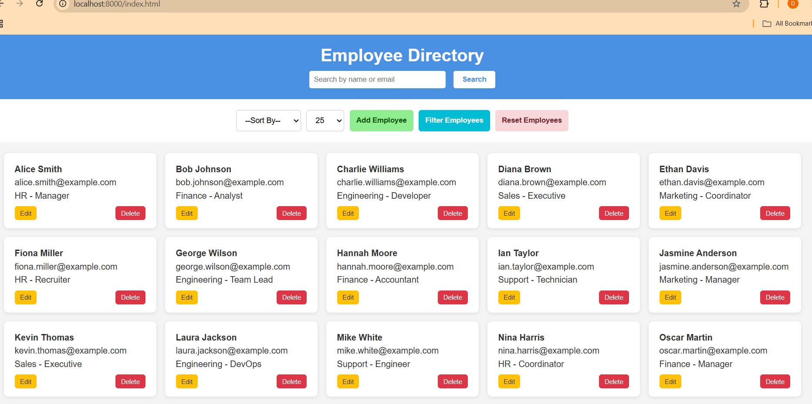
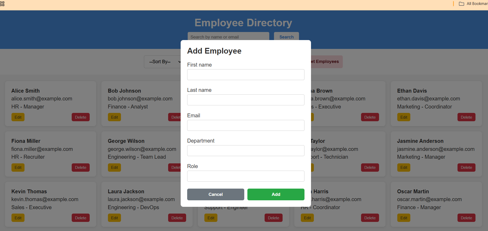

SetUp 
python3 -m http.server
npm install -g http-server
http-server

The Employee Directory Web Interface is a responsive and interactive application built using HTML, CSS, and JavaScript to manage and display employee data. The application allows users to view, search, sort, filter, and manage employees with features like pagination, modals for adding/editing, and dynamic rendering of employee cards. One of the main challenges faced during development was handling dynamic UI updates—especially ensuring seamless integration between the filtering, pagination, and search functionalities. Additionally, managing modal state (for adding and editing) without conflicting logic proved tricky. Styling the UI to be both clean and responsive on different screen sizes also required careful CSS adjustments. If given more time, I would focus on implementing more robust form validation with clear error messages, enhance the UI/UX with role-based color badges and transitions, and restructure the codebase using a frontend framework like React for better state management and modularity. Furthermore, integrating a backend for persistent data storage and user authentication would significantly enhance the app’s functionality and scalability.

